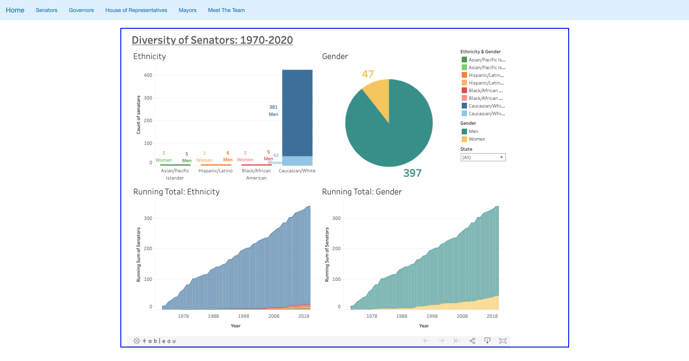

*Click [here](https://github.com/mattfreshwaters/matt-freshwaters-public-portfolio/blob/main/matt-freshwaters-public-portfolio.pdf) to download the most recent `.pdf`*

## Full Stack Engineer ##

---

### About  ###

---

### Contact Information ###

* **Phone:** `(650) 556-4021`
* **Email:** ```mattfreshy@gmail.com```
* **LinkedIn:** https://www.linkedin.com/in/matthew-freshwaters/
* **Website:** 
  * *Coming Soon*

### Education ###

* Pepperdine University (2016-2020)
* Computer Science for Business Administration
* Bachelor of Science (BS)

### Summary ###

My name is Matt Freshwaters and I am a recent college graduate working at Talent Path working as a full stack engineer.  Experience in writing full stack applications with SpringBoot, PostgreSQL, and using Angular or React on the front-end.  

---

---

# Personal Projects #

## Owner & Creator ##

### [Weight Tracker](https://github.com/mattfreshwaters/WeightTracker) ###

* Weight Tracker is a web application built with Spring Boot, PostgreSQL, and Angular.  This is one of my first full stack applications I have built, inspired by a mobile application I have on my phone that tracks your weight by connecting to a scale.  The purpose of this application is to allow users to input their weight on a give date, and to set goals for how much they would like to weight in the future.  The application then uses a third party library called [ApexCharts](https://apexcharts.com/) to graph the user's weight along with their goals to visually represent how a user is to meeting his or her goals.
* The purpose of this application was to use my skillset to create a full-stack application. I was able to take an existing application that inspired me and add new functionality to it.
* Below is a short clip of some of the basic functionality of the application:


## Contributor ##

### Shamazin ###

* Shamazin is a web application built with Spring Boot, PostgreSQL, and React.  I developed the Questions & Answers component for the application, as well as perform various code reviews.
* Our team used Github for Version Control and followed the Agile methodology to complete this project with weekly sprints, daily standup meetings, and weekly retrospectives.
* Below is a short clip showing some functionality of the website:


## Contributor ##

### Diversity ###

* The Diversity project was an initiative from Talent Path to have Full Stack Engineers collaborate with Data Analysts to display data regarding publicly held positions in the United States over the last 70 years.  The data analysts pooled data about US Congress members, Governors, and mayors of the top 20 popular cities.
* The DAs provided interactive graphs created in Tableau through an API link that I used to display them on a web page.
* Below is a sample image 



---

---

# Experience #

##  Talent Path - Full Stack Engineer  ##

* Completed a rigorous 9 week training program learning full stack technologies.
* Collaborated with an agile team to successfully develop an application from conception to production.
* Managed projects via Github by leveraging Kanban boards, source control, and issue tracking.  Reviewing peers code during pull requests to ensure efficient, quality code for each project.
* Developed back-end code for severs using Spring Boot, Spring Data JPA, and PostgreSQL.
* Leveraged front-end technologies such as Angular and React.js to create UI for projects.


##  Pepperdine University - Application Development Intern ##

* Worked with a team of interns to create a .NET application to electronically sign XML documents.
* Implemented languages such as C#, JavaScript, HTML, CSS, Bootstrap, and JQuery.
* Developed code with Microsoft Visual Studio and Microsoft SQL Databases


##  Stanford University - Software Developer Intern ##

* Worked with the Endpoint Engineering Team to work on projects included in Stanford's innovation fund.
* Leveraged Node.js to create API endpoints to support mobile applications.
* Deployed programs to cloud providers such as AWS and GCP, using tools such as AWS Lambda & DynamoDB.


